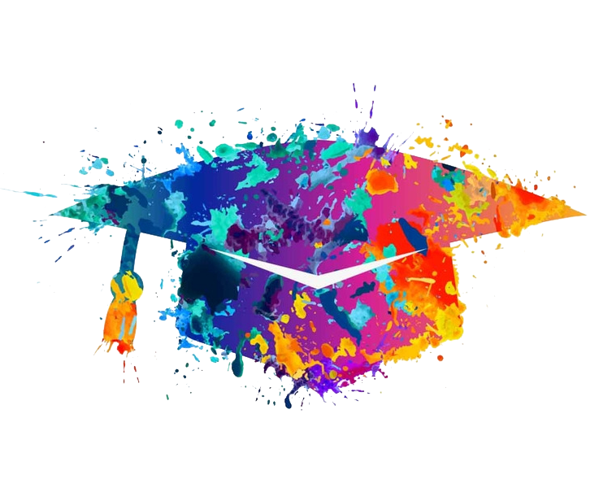

```{r titleslide, child="components/titleslide.Rmd"}
```


```{r setup2, include=FALSE}
library(tidyverse)
library(knitr)
library(kableExtra)
library(textdata)
library(tm)
library(readxl)
library(haven)
library(vctrs)
library(knitr)
library(kableExtra)
library(knitr)
library(lubridate)
library(gridExtra)
library(plotly)
library(broom)
library(broomstick)
library(hpackedbubble)
#library(split)
library(magick)
library(ISLR)
library(ggwordcloud)

opts_chunk$set(echo = TRUE,   
               out.width = "100%",
               message = FALSE,
               warning = FALSE,
               collapse = TRUE,
               fig.height = 4,
               fig.width = 8,
               fig.align = "center",
               dpi = 300,
               cache = FALSE)

as_table <- function(...) knitr::kable(..., format='html', digits = 3)
```


---
class:transition
# My story in data science

```{r out.width = '70%', echo = FALSE}
include_graphics("images/Beaglechannel.jpg")
```

---
# "4th Industrial revolution"

<br><br>

.pull-right[
```{r out.width = '80%', echo = FALSE}
include_graphics("images/data.png")
```
]

**Data is driving the 4th Industrial Revolution**

<br>

**Top jobs**
<br>
.content-box-soft[
- Data Scientists 19% expected growth
- Statistician   33% expected growth
]
<br>
.small[
[Source: https://www.careercast.com/jobs-rated/best-jobs-of-2019](https://www.careercast.com/jobs-rated/best-jobs-of-2019)]

.small[Cartoon by Hiclipart.com]


---
# Data Analysts/Scientists?

```{r out.width = '60%', echo = FALSE}
include_graphics("images/hiclipart.png")
```

.small[

Cartoon by Hiclipart.com

]

---
class:transition
# My definition
<br>

*"Data analyst/scientist is a professional who analyzes, (sometimes collects) and interprets
**data**, using statistical, mathematical and computational
methods"*

<br>

Patricia Menéndez
```{r out.width = '35%', echo = FALSE}

```
.small[
Cartoon by Hiclipart.com
]


---
# The multiple doors to data science

<br>

.pull-left[

```{r out.width = '120%', echo = FALSE}

```
<br>
The multiple doors to data science 
 .small[<span>Photo by <a href="https://unsplash.com/@thevisualiza?utm_source=unsplash&amp;utm_medium=referral&amp;utm_content=creditCopyText">Dil</a> on <a href="https://unsplash.com/s/photos/doors?utm_source=unsplash&amp;utm_medium=referral&amp;utm_content=creditCopyText">Unsplash</a></span>]

]
--
.pull-right[

```{r out.width = '80%', echo = FALSE}

```
Mathematics and Statistics
.small[<span>Photo by <a href="https://unsplash.com/@sinusfiction?utm_source=unsplash&amp;utm_medium=referral&amp;utm_content=creditCopyText">Sies Kranen</a> on <a href="https://unsplash.com/?utm_source=unsplash&amp;utm_medium=referral&amp;utm_content=creditCopyText">Unsplash</a></span>]
]

--


---
# Strong quantitative/computational training


```{r out.width = '80%', echo = FALSE}
include_graphics("images/lachlan-donald-YVT5aF2QM7M-unsplash.jpg")
```
.small[
<span>Photo by <a href="https://unsplash.com/@lox?utm_source=unsplash&amp;utm_medium=referral&amp;utm_content=creditCopyText">Lachlan Donald</a> on <a href="https://unsplash.com/s/photos/tools?utm_source=unsplash&amp;utm_medium=referral&amp;utm_content=creditCopyText">Unsplash</a></span>
]


---
# The academic skills that I have found very useful

<br><br>
.content-box-neutral[
- Good .green[mathematical and statistical] training
- .green[Algorithmics] knowledge -->  "Algorithmics is the systematic study of the design and analysis of algorithms" .small[ [Wikipedia definition ](https://en.wikipedia.org/wiki/Algorithmics) ] 
- .green[Strong computational skills] --> different programming languages
- .green[Problem solving] skills
- The capacity to --> .green[translate a real problem into a quantitative /data science] one
]

```{r out.width = '20%', echo = FALSE}

```
.small[
Cartoon by Hiclipart.com
]
---
# Other skills that I have found very useful

<br>
.content-box-neutral[
- Set clear goals an expectations for a project
- Adapt to changes
- Being able to listen and to learn from different viewpoints
- Capacity to communicate your findings to specialized and broad audiences
- Embrace criticism and use it to get better!
- Professional integrity and high standards
- Ethics
]

.pull-right[
```{r out.width = '25%', echo = FALSE}
include_graphics("images/softskills.png")
```

]
.small[
Cartoons by Hiclipart.com
]
---
# The learning never ends! 

```{r out.width = '75%', echo = FALSE}
include_graphics("images/erwan-hesry-WPTHZkA-M4I-unsplash.jpg")
```

.small[
<span>Photo by <a href="https://unsplash.com/@erwanhesry?utm_source=unsplash&amp;utm_medium=referral&amp;utm_content=creditCopyText">Erwan Hesry</a> on <a href="https://unsplash.com/s/photos/firework?utm_source=unsplash&amp;utm_medium=referral&amp;utm_content=creditCopyText">Unsplash</a></span>]

---
# Communicating to broad audiences: my first experience

```{r out.width = '45%', echo = FALSE}
include_graphics("images/luis-villasmil-mlVbMbxfWI4-unsplash.jpg")
```


.small[<span>Photo by <a href="https://unsplash.com/@villxsmil?utm_source=unsplash&amp;utm_medium=referral&amp;utm_content=creditCopyText">Luis Villasmil</a> on <a href="https://unsplash.com/s/photos/bored?utm_source=unsplash&amp;utm_medium=referral&amp;utm_content=creditCopyText">Unsplash</a></span>]


---
# The skills that I had to develop

<br>
.pull-left[
```{r out.width = '120%', echo = FALSE}
include_graphics("images/julie-thornton-UWdgTvf3m8g-unsplash.jpg")
```


.small[
<span>Photo by <a href="https://unsplash.com/@thevisualiza?utm_source=unsplash&amp;utm_medium=referral&amp;utm_content=creditCopyText">Dil</a> on <a href="https://unsplash.com/s/photos/doors?utm_source=unsplash&amp;utm_medium=referral&amp;utm_content=creditCopyText">Unsplash</a></span>

]
]


.pull-right[

.content-box-neutral[
- Theory and practice are two different things!
- Communicating with people in other disciplines is **not** easy and requires **lots** of practice --> **master it**!
- Ask questions!
- Set real expectations and deadlines
- Fresh air is always good :-)!
]
]

---
# Companies and governments use data and want ...
<br>

.content-box-neutral[
**Answers!**
<br>
- Use your .green[data analyst toolbox] --> stats/maths methods + computational implementation
- Create solutions and .green[know what you are doing]!
]


.content-box-neutral[
**They want to be able to understand the answers**:
  <br>
  - .green[Specialized audiences] --> know your methods well 
  - .green[Broad audiences] --> focus on the answers
]

  


---
# Each data set has it own story
<br>

.pull-left[
.content-box-soft[
- Talk to the people who collect the data
- Their knowledge is invaluable
- Learn about the context
- Context is fundamental to the analysis & essential for the story telling of your project
- Know how to interact with databases 
- Data wrangling
- Plot, plot, plot, plot your data!]
]


.pull-right[
```{r out.width = '120%', echo = FALSE}

```
]


---
# Reproducibility and open source
<br><br>

.pull-right[
```{r out.width = '20%', echo = FALSE}

```
]

- .green[Reproducibility] means obtaining consistent computational results using the same input data, computational
step, methods, code and conditions of analysis. .small[*Definition by the USA National Academies of Science, Engineering and Medicine*]

<br>
- .green[Open source code:] It is code where its authors make it available to others (under some open license) so that the code can be viewed, copy, inspect and alter by others.


.pull-right[
```{r out.width = '20%', echo = FALSE}
include_graphics("images/opensource.png")
```
]
<br>
.small[
Cartoons by Hiclipart.com
]

---
# Version control and open source software examples

```{r out.width = '40%', echo = FALSE}
include_graphics("images/Git-Logo-Black copy.png")
```

```{r out.width = '30%', echo = FALSE}
include_graphics("images/Rlogo.png")
```


```{r out.width = '40%', echo = FALSE}
include_graphics("images/python.png")
```
---
# Reproducible workflows


```{r out.width = '100%', echo = FALSE}
include_graphics("images/environmental-data-science-r4ds-general.png")
```
@allison_horst

---
# Documentation is essential to reproducibility
<br>
.pull-left[
```{r out.width = '65%', echo = FALSE}
include_graphics("images/ralph-ravi-kayden-iOLHAIaxpDA-unsplash.jpg")
```


.small[<span>Photo by <a href="https://unsplash.com/@ralphkayden?utm_source=unsplash&amp;utm_medium=referral&amp;utm_content=creditCopyText">Ralph (Ravi) Kayden</a> on <a href="https://unsplash.com/s/photos/electricity-boxes-broken?utm_source=unsplash&amp;utm_medium=referral&amp;utm_content=creditCopyText">Unsplash</a></span>]
]
.pull-right[
.content-box-soft[ 
- Data science projects can be very complex
- Large multidisciplinary team
- Each piece is part of the puzzle
- The instructions to connect the pieces are essential
- Documentation to ensure reproducibility and longevity of the project is critical!]
]
---
# The infinity of angles in data science

```{r out.width = '80%', echo = FALSE}

```


.small[
<span>Photo by <a href="https://unsplash.com/@nicolafioravanti?utm_source=unsplash&amp;utm_medium=referral&amp;utm_content=creditCopyText">Nicola Fioravanti</a> on <a href="https://unsplash.com/s/photos/escher?utm_source=unsplash&amp;utm_medium=referral&amp;utm_content=creditCopyText">Unsplash</a></span>
]


---
class: transition
# Data science depth
<br>
.pull-left[
- Data scientists come from different backgrounds
- Huge diversity in expertise, specialization and also in available jobs
- Know your strengths and also your limitations 
- **Don't autopilot** --> Know what you are doing 
- Keep learning!
]
.pull-right[

```{r out.width = '90%', echo = FALSE}
include_graphics("images/david-holifield-XUFKd-5jC64-unsplash.jpg")
```

.small[<span>Photo by <a href="https://unsplash.com/@davidholifield?utm_source=unsplash&amp;utm_medium=referral&amp;utm_content=creditCopyText">David Holifield</a> on <a href="https://unsplash.com/s/photos/layered-cake?utm_source=unsplash&amp;utm_medium=referral&amp;utm_content=creditCopyText">Unsplash</a></span>]
]

---
# Know how to --> but most importantly why to!

```{r out.width = '60%', echo = FALSE}
include_graphics("images/the-new-york-public-library-kvHhSroTNPY-unsplash.jpg")
```

.small[<span>Photo by <a href="https://unsplash.com/@nypl?utm_source=unsplash&amp;utm_medium=referral&amp;utm_content=creditCopyText">The New York Public Library</a> on <a href="https://unsplash.com/s/photos/astronaut?utm_source=unsplash&amp;utm_medium=referral&amp;utm_content=creditCopyText">Unsplash</a></span>]
---
class: transition
# Thank you very much!

.pull-left[
```{r out.width = '70%', echo = FALSE}
include_graphics("images/alex-azabache-V83v-MYB_Z8-unsplash.jpg")
```
.small[
<span>Photo by <a href="https://unsplash.com/@alexazabache?utm_source=unsplash&amp;utm_medium=referral&amp;utm_content=creditCopyText">Alex Azabache</a> on <a href="https://unsplash.com/s/photos/allice-in-wonderland-quotes?utm_source=unsplash&amp;utm_medium=referral&amp;utm_content=creditCopyText">Unsplash</a></span>]

]
.pull-right[

<br><br>
patricia.menendez@monash.edu
@PM_maths

<br>
- Interested in collaborations with industry including contract research and training
- Multidisciplinary research 

<br>

**Feel free to
reach out!**
]


